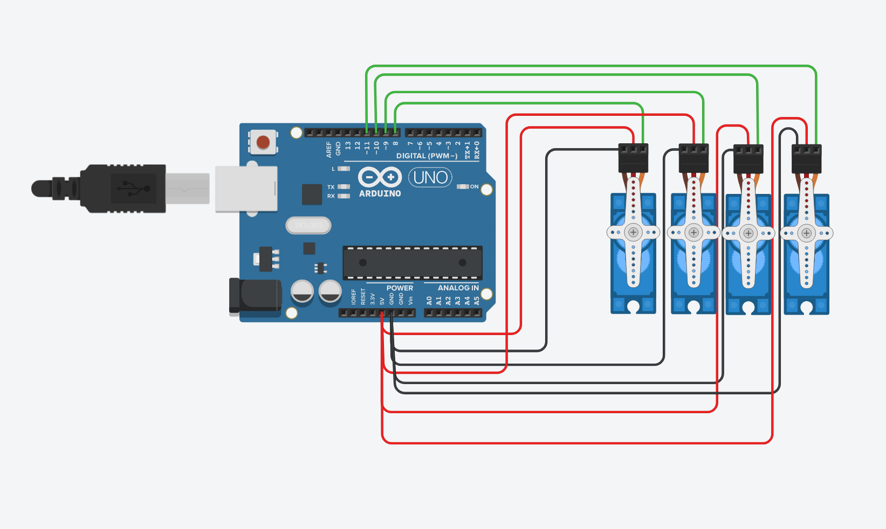
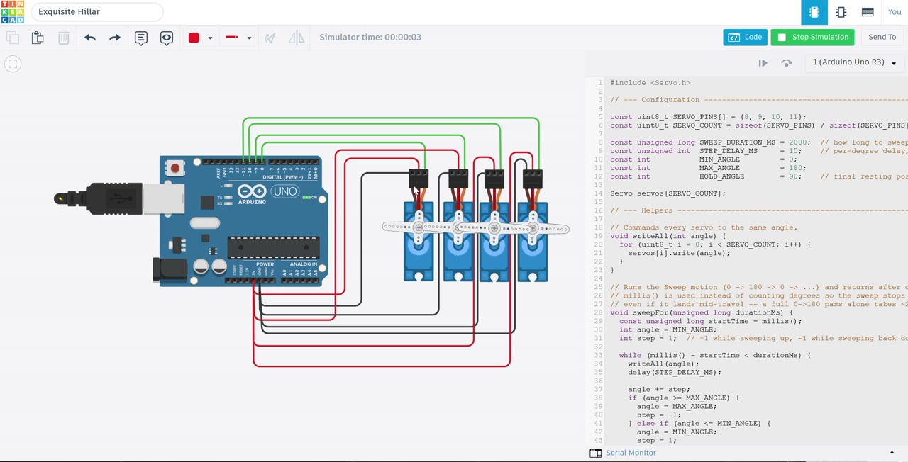

# ST-2026 · Arduino 4-Servo Sweep

Four servo motors on an **Arduino Uno** run the classic **Sweep** motion together for exactly **2 seconds**, then every one of them snaps to **90°** and holds there. Electrical task of the Smart Methods (ST 2026) summer training.



> 🔗 **Open the circuit in Tinkercad (live):** https://www.tinkercad.com/things/hw2H0GCtmVS-exquisite-hillar?sharecode=1qT-GIzIRtQaZ4dm_rTE8ap5UO8XWDL_4PuD9AocLoY
> *(the `sharecode` in the link is what makes it viewable by anyone — keep it on the URL)*
>
> 🔗 **Live simulation:** open [`index.html`](index.html) in any browser to watch the four servos sweep and then hold — with a millisecond clock and an angle-vs-time graph. *(No install, no Arduino needed. If you enable GitHub Pages on this repo, it will also be live at `https://sniper797.github.io/ST-2026-Arduino-4-Servo-Sweep/`.)*

---

## 1. The task

From the Smart Methods brief:

| # | Requirement | Where it lives |
|---|---|---|
| 1 | Program **4 servo motors** | `SERVO_PINS[]` array + `Servo servos[4]` in [the sketch](ST-2026-Arduino-4-Servo-Sweep.ino) |
| 2 | Run using the **Sweep** example for **2 seconds** | `sweepFor(2000)` — the 0°↔180° Sweep motion, timed with `millis()` |
| 3 | After that, make **all** the motors **hold at 90°** | `writeAll(90)` then an empty `loop()` |

---

## 2. What "Sweep" is

**Sweep** is the example sketch that ships with the Arduino `Servo` library
(*File → Examples → Servo → Sweep*). It moves the horn **one degree at a time from
0° to 180°**, waiting **15 ms** on each degree, then walks all the way back — over and
over. That slow "windscreen-wiper" motion *is* the sweep.

One important number: a full 0→180 pass takes **180 × 15 ms ≈ 2.7 seconds** — which is
*longer* than the 2 seconds this task allows. So the sweep gets cut off partway, at
`2000 ÷ 15 ≈ 133°`, and then the motors jump to 90° and hold. That is the correct
reading of the brief: *sweep **for** 2 seconds*, not *finish a full sweep*.

---

## 3. The circuit

| Servo | Signal wire (orange) → Arduino pin | Power |
|---|---|---|
| Servo 1 | **D8** | red → 5V, black → GND |
| Servo 2 | **D9** | red → 5V, black → GND |
| Servo 3 | **D10** | red → 5V, black → GND |
| Servo 4 | **D11** | red → 5V, black → GND |

> ⚠️ **On real hardware, don't power four servos from the Arduino's 5V pin.** Four moving
> servos can pull well over an amp, and the USB-powered 5V pin can't supply that — the
> board will brown-out and reset. Use a separate 5V supply for the servos and connect its
> **GND to the Arduino GND**. In the Tinkercad simulator the on-board 5V rail is ideal, so
> wiring them all to 5V there is fine.

---

## 4. See it run (Tinkercad recording)

[](docs/screenshots/demo.mp4)

▶️ **[Play the recording](docs/screenshots/demo.mp4)** — a screen capture of this exact
sketch running in the Tinkercad simulator: the four servos sweep, then hold at 90°.

> The video **plays inline on the [GitHub Pages site](https://sniper797.github.io/ST-2026-Arduino-4-Servo-Sweep/)** (once Pages is enabled). GitHub does not play a committed video *inside* a README, so here it appears as the clickable thumbnail above. To make it play *inline in this README* instead, open the README in GitHub's web editor and drag `docs/screenshots/demo.mp4` into it — GitHub re-hosts it as an inline player.

## 5. The demo page

[`index.html`](index.html) is a single self-contained web page (no libraries) that plays
the sketch back and also embeds the recording above: four servo horns rotating exactly as
the code commands them, a live millisecond clock, a phase badge that flips from
**SWEEPING** to **HOLDING 90°** at the 2 s mark, and an oscilloscope-style plot of
commanded angle vs. time. It even draws a dashed "ghost" line showing where the sweep
*would* have kept going without the 2-second cut-off.

---

## 6. Explain it like I'm 5 🧒

Imagine you have **four little robot arms** on a table.

1. **Wake them up.** First you plug each arm in and switch it on.
   → in code: `attach()` connects each servo to its pin.

2. **Wave!** You tell all four arms to wave slowly — swing all the way to one side,
   then all the way to the other, again and again. The slow swinging is the **sweep**.
   → in code: `sweepFor()` moves them one small step at a time, with a tiny pause
   (`delay(15)`) so it looks smooth instead of jumpy.

3. **Use a stopwatch.** You don't let them wave forever. You start a stopwatch and say
   *"keep waving until 2 seconds are up."* When the stopwatch hits 2 seconds, waving stops.
   → in code: `millis()` is the stopwatch; the `while` loop keeps going only while
   fewer than 2000 ms have passed.

4. **Freeze!** The moment time is up, you shout *"everybody stop, point to the middle!"*
   and all four arms jump to the halfway spot (90°) and stand as still as statues.
   → in code: `writeAll(90)` sends every arm to 90°.

5. **Nobody bothers them again.** After that, no one gives the arms a new order, so they
   just stay frozen at 90° until you turn the power off.
   → in code: `loop()` is left **empty**, so nothing ever changes their position.

That's the whole program: **wake up → wave for 2 seconds → freeze at the middle → stay.**

---

## 7. The code, a little deeper

```cpp
#include <Servo.h>
const uint8_t SERVO_PINS[] = {8, 9, 10, 11};   // one pin per servo
Servo servos[4];                                // one Servo object per motor
```
Four motors need four `Servo` objects, so we keep them in an **array**. That lets a single
`for` loop talk to all of them instead of copy-pasting every command four times.

```cpp
void writeAll(int angle) {
  for (uint8_t i = 0; i < 4; i++) servos[i].write(angle);
}
```
`writeAll(90)` sends the same angle to all four servos in a split second — so they move
as one.

```cpp
void sweepFor(unsigned long durationMs) {
  unsigned long startTime = millis();          // start the stopwatch
  int angle = 0, step = 1;                      // step = +1 up, -1 down
  while (millis() - startTime < durationMs) {   // until 2 s have passed
    writeAll(angle);
    delay(15);                                  // smooth, not jumpy
    angle += step;
    if (angle >= 180) { angle = 180; step = -1; }   // hit the top → go down
    else if (angle <= 0) { angle = 0; step = 1;  }   // hit the bottom → go up
  }
}
```
This is the heart of it. A normal Sweep uses two `for` loops that *must* run to the end —
you can't stop them at 2 seconds. Timing with `millis()` instead lets us cut the sweep off
at exactly 2000 ms, wherever it happens to be (about 133°).

```cpp
void setup() {
  for (uint8_t i = 0; i < 4; i++) servos[i].attach(SERVO_PINS[i]);
  sweepFor(2000);     // step 1: sweep for 2 seconds
  writeAll(90);       // step 2: hold at 90°
}
void loop() { }       // empty on purpose — the servos stay at 90°
```
Everything is in `setup()` because it happens **once**. If it were in `loop()` it would
sweep-hold-sweep-hold forever. "Holding" needs no code: once `write(90)` is sent, the
library keeps pulsing that position and the motor resists being pushed off it.

---

## 8. How to run it

**On real hardware / Tinkercad**
1. Open the [Arduino IDE](https://www.arduino.cc/en/software) (or Tinkercad Circuits).
2. Open `ST-2026-Arduino-4-Servo-Sweep.ino`.
3. Wire the servos as in the table above.
4. Upload (real board) or press **Start Simulation** (Tinkercad).
5. Watch: ~2 s of sweeping, then all four freeze at 90°.

**Just the animation** — double-click [`index.html`](index.html). No board required.

---

*Part of my Smart Methods (ST 2026) summer training · Electrical · Task 1*
